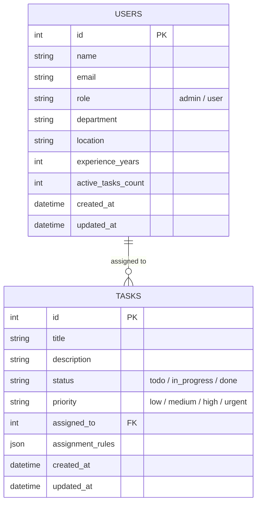

# Indus Action - Dynamic Task Allocation Engine

A high-performance, resilient, and role-based task management system built with **Laravel 11 API**, **Angular 18+ , **Redis**, and **PostgreSQL/MySQL**. 

This system features backend-driven data scoping, a dynamic task allocation rule engine, real-time candidate eligibility previewing, and an admin management interface.

---

## 🛠 Project Setup Instructions

### Prerequisites
* Docker & Docker Compose
* Git

### Quickstart with Docker Compose

1. **Clone the repository:**
   ```bash
   git clone [https://github.com/your-username/indus-action-task-engine.git](https://github.com/your-username/indus-action-task-engine.git)
   cd indus-action-task-engine

# Indus Action Task Engine — API Documentation

## Overview

**Indus Action Task Engine** is a task management API built to handle user authentication and task board operations, with role-based access control (Admin vs. standard user).

- **Repository:** [indus-action-task-engine](https://github.com/abhil448/indus-action-task-engine)
- **Base URL:** `http://localhost:800/api`
- **Authentication:** Laravel Sanctum (Bearer token)

---

## Architecture Decisions

- **Backend-Driven Data Scoping:** Security and query filtering are enforced at the API database level (`GET /api/tasks`). Non-admin users only receive records assigned directly to them, preventing unauthorized data exposure and minimizing frontend payload sizes.
- **Modern Angular 18+ Architecture:** Implemented using Angular Standalone Components without legacy NgModules. Uses Angular Signals (`signal`, `computed`) for reactive state management across all task feeds and status updates.
- **Asynchronous Offloading:** Task candidate processing and rule matching execute via queue workers backed by Redis, preserving fast sub-100ms API response times during creation.
- **Stateless Token Authentication:** Authenticated with Laravel Sanctum Bearer tokens. Client-side navigation is protected by functional Angular Route Guards (`authGuard` and `adminGuard`).

---

## Database Design

The schema prioritizes data integrity and query efficiency for real-time rule matching.

### Schema Blueprint

**`users` Table** — Stores profile parameters used by the allocation engine:

| Column               | Type              | Notes                                          |
|----------------------|-------------------|-------------------------------------------------|
| `id`                 | PK                |                                                   |
| `name`               | string            |                                                   |
| `email`              | string            |                                                   |
| `password`           | string            |                                                   |
| `role`               | enum              | `admin`, `user`                                  |
| `department`         | string            | e.g., `Education`, `Healthcare`, `RTI`           |
| `location`           | string            | e.g., `Delhi`, `Mumbai`                          |
| `experience_years`   | integer           |                                                   |
| `active_tasks_count` | unsigned integer  | Maintained dynamically                           |

**`tasks` Table** — Tracks task metadata, status, priority, and JSON rule definitions:

| Column              | Type          | Notes                                       |
|---------------------|---------------|-----------------------------------------------|
| `id`                | PK            |                                                |
| `title`             | string        |                                                |
| `description`       | text          |                                                |
| `status`            | enum          | `todo`, `in_progress`, `done`                 |
| `priority`          | enum          | `low`, `medium`, `high`, `urgent`             |
| `assigned_to`       | FK (nullable) | References `users.id`                         |
| `assignment_rules`  | JSON / JSONB  | Stores filter parameters                      |

**`personal_access_tokens` Table** — Managed by Laravel Sanctum for API access control.

---

## ER Diagram



---

## Authentication

All endpoints (except `register` and `login`) require the following headers:

| Header          | Value                    |
|-----------------|--------------------------|
| `Accept`        | `application/json`       |
| `Authorization` | `Bearer <token>`         |

Tokens are issued via Laravel Sanctum upon successful login and must be included on every subsequent request. Tokens remain valid until the user logs out (`/api/logout`) or the token is otherwise revoked.

---

## Authentication Endpoints

### Register

Create a new user profile.

```
POST /api/register
```

**Headers**

```
Accept: application/json
Content-Type: application/json
```

**Request Body**

```json
{
  "name": "Jane Doe",
  "email": "jane.doe@example.com",
  "password": "SecurePass123!",
  "password_confirmation": "SecurePass123!"
}
```

**Response `201 Created`**

```json
{
  "message": "User registered successfully.",
  "user": {
    "id": 1,
    "name": "Jane Doe",
    "email": "jane.doe@example.com",
    "role": "user",
    "created_at": "2026-09-18T10:00:00Z"
  }
}
```

**Error `422 Unprocessable Entity`**

```json
{
  "message": "The email has already been taken.",
  "errors": {
    "email": ["The email has already been taken."]
  }
}
```

---

### Login

Authenticate a user and issue a Sanctum token.

```
POST /api/login
```

**Headers**

```
Accept: application/json
Content-Type: application/json
```

**Request Body**

```json
{
  "email": "jane.doe@example.com",
  "password": "SecurePass123!"
}
```

**Response `200 OK`**

```json
{
  "message": "Login successful.",
  "token": "1|abcdefghijklmnopqrstuvwxyz123456",
  "user": {
    "id": 1,
    "name": "Jane Doe",
    "email": "jane.doe@example.com",
    "role": "user"
  }
}
```

**Error `401 Unauthorized`**

```json
{
  "message": "Invalid credentials."
}
```

---

### Logout

Invalidate the current session token.

```
POST /api/logout
```

**Headers**

```
Accept: application/json
Authorization: Bearer <token>
```

**Response `200 OK`**

```json
{
  "message": "Logged out successfully."
}
```

**Error `401 Unauthorized`**

```json
{
  "message": "Unauthenticated."
}
```

---

## Task Management Endpoints

### Get Tasks

Retrieve task board data. Scoped to the logged-in user; Admins receive all tasks.

```
GET /api/tasks
```

**Headers**

```
Accept: application/json
Authorization: Bearer <token>
```

**Response `200 OK`**

```json
{
  "data": [
    {
      "id": 12,
      "title": "Design onboarding flow",
      "status": "in_progress",
      "assigned_to": 1,
      "created_at": "2026-09-15T09:30:00Z",
      "updated_at": "2026-09-17T14:00:00Z"
    },
    {
      "id": 13,
      "title": "Fix login bug",
      "status": "pending",
      "assigned_to": 4,
      "created_at": "2026-09-16T11:00:00Z",
      "updated_at": "2026-09-16T11:00:00Z"
    }
  ]
}
```

---

### Get Task Details

Retrieve details for a single task.

```
GET /api/tasks/{id}
```

**Headers**

```
Accept: application/json
Authorization: Bearer <token>
```

**Path Parameters**

| Parameter | Type    | Description       |
|-----------|---------|--------------------|
| `id`      | integer | Task ID            |

**Response `200 OK`**

```json
{
  "data": {
    "id": 12,
    "title": "Design onboarding flow",
    "description": "Create wireframes for the new user onboarding experience.",
    "status": "in_progress",
    "assigned_to": 1,
    "created_at": "2026-09-15T09:30:00Z",
    "updated_at": "2026-09-17T14:00:00Z"
  }
}
```

**Error `404 Not Found`**

```json
{
  "message": "Task not found."
}
```

---

### Create Task

Create a new task and trigger the assignment queue. **Admin only.**

```
POST /api/tasks
```

**Headers**

```
Accept: application/json
Authorization: Bearer <token>
Content-Type: application/json
```

**Request Body**

```json
{
  "title": "Prepare release notes",
  "description": "Draft release notes for v1.4.0.",
  "assigned_to": 3,
  "priority": "high"
}
```

**Response `201 Created`**

```json
{
  "message": "Task created and queued for assignment.",
  "data": {
    "id": 14,
    "title": "Prepare release notes",
    "status": "pending",
    "assigned_to": 3,
    "created_at": "2026-09-18T10:15:00Z"
  }
}
```

**Error `403 Forbidden`**

```json
{
  "message": "This action is unauthorized."
}
```

---

### Update Task

Update a task's state or attributes.

```
PUT /api/tasks/{id}
```

**Headers**

```
Accept: application/json
Authorization: Bearer <token>
Content-Type: application/json
```

**Path Parameters**

| Parameter | Type    | Description       |
|-----------|---------|--------------------|
| `id`      | integer | Task ID            |

**Request Body**

```json
{
  "status": "completed"
}
```

**Response `200 OK`**

```json
{
  "message": "Task updated successfully.",
  "data": {
    "id": 12,
    "title": "Design onboarding flow",
    "status": "completed",
    "updated_at": "2026-09-18T10:20:00Z"
  }
}
```

**Error `404 Not Found`**

```json
{
  "message": "Task not found."
}
```

---

### Delete Task

Delete a task. **Admin only.**

```
DELETE /api/tasks/{id}
```

**Headers**

```
Accept: application/json
Authorization: Bearer <token>
```

**Path Parameters**

| Parameter | Type    | Description       |
|-----------|---------|--------------------|
| `id`      | integer | Task ID            |

**Response `200 OK`**

```json
{
  "message": "Task deleted successfully."
}
```

**Error `403 Forbidden`**

```json
{
  "message": "This action is unauthorized."
}
```

---

## Roles & Permissions

| Action              | Standard User | Admin |
|---------------------|:--------------:|:-----:|
| View own tasks       | ✅ | ✅ |
| View all tasks       | ❌ | ✅ |
| View task details    | ✅ | ✅ |
| Create task          | ❌ | ✅ |
| Update task          | ✅ | ✅ |
| Delete task          | ❌ | ✅ |

---

## Error Handling

All errors follow a consistent JSON structure:

```json
{
  "message": "Human-readable error message.",
  "errors": {
    "field_name": ["Specific validation error."]
  }
}
```

**Common Status Codes**

| Code | Meaning                | Description                                  |
|------|------------------------|-----------------------------------------------|
| 200  | OK                      | Request succeeded.                            |
| 201  | Created                 | Resource created successfully.                |
| 401  | Unauthorized            | Missing or invalid authentication token.      |
| 403  | Forbidden               | Authenticated but not permitted (role-based). |
| 404  | Not Found               | Resource does not exist.                      |
| 422  | Unprocessable Entity    | Validation failed.                            |
| 500  | Internal Server Error   | Unexpected server error.                      |

---

*Note: Sample request/response payloads above are illustrative, based on standard Laravel Sanctum conventions. Replace with actual payloads from your implementation where they differ.*
   